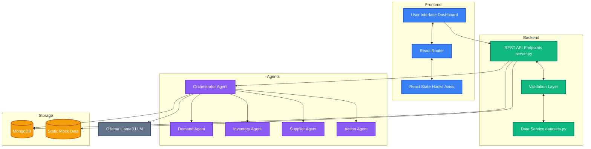
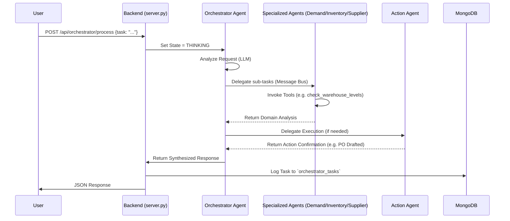

# SupplyMind: Detailed Project Documentation

Welcome to the internal documentation for **SupplyMind**, an Agentic AI Operating System designed for Supply Chain Intelligence. This document aims to provide a comprehensive, 360-degree view of the project architecture, multi-agent workflows, frontend components, state management, and data pathways. A new developer should be able to read this document and immediately understand how all the pieces of SupplyMind fit together without needing external assistance.

---

## 1. High-Level System Architecture

SupplyMind uses a modern client-server architecture supplemented by a sophisticated Multi-Agent AI System powered by LangChain and local LLM inference (Ollama).

### Core Architecture DiagramMarkdown Preview Mermaid Support



---

## 2. The Multi-Agent System (The "Brain")

At the core of SupplyMind is the multi-agent orchestration layer built using LangChain, LangGraph, and a local instance of Llama3 via Ollama.

### 2.1 Agent Roles and Capabilities

The system defines 5 specific agents, each holding a specialized prompt and toolset:

1. **Orchestrator Agent**:

   - **Role**: The supervisor. It receives the high-level user prompt (e.g., "Analyze low inventory for Widget A"), decomposes the task, determines which sub-agents to trigger, and synthesizes their responses.
   - **State**: Tracks overall progress and coordinates the cross-agent message bus.
2. **Demand Agent**:

   - **Role**: Forecaster & Analyst.
   - **Tools**: `forecast_demand` (time series analysis/math), `analyze_stockout_risk`.
3. **Inventory Agent**:

   - **Role**: Optimizer.
   - **Tools**: `calculate_reorder_point` (calculates Economic Order Quantity and Safety Stock), `check_warehouse_levels`.
4. **Supplier Agent**:

   - **Role**: Risk Assessor.
   - **Tools**: `score_supplier_risk` (scores financial, performance, quality, and news sentiments), `get_shipping_options`, `get_market_intelligence`.
5. **Action Agent**:

   - **Role**: Executor.
   - **Tools**: `generate_purchase_order`.

### 2.2 Agent Communication and Workflow

The agents communicate via LangGraph and an internal message bus.



### 2.3 Agent State Management (`server.py`)

To allow the React frontend to display live UI updates, the backend maintains a global dictionary of agent states:

```python
# From server.py
agent_states = {
    AgentRole.ORCHESTRATOR: {"status": AgentStatus.IDLE, ...},
    AgentRole.DEMAND: {"status": AgentStatus.IDLE, ...},
    # ...
}
```

Available statuses: `IDLE`, `THINKING`, `ACTING`, `WAITING`.
The frontend iteratively polls `/api/agents/states` every 5 seconds to provide visual feedback (colored pulse dots in the UI).

---

## 3. Backend Architecture (`backend/`)

The backend is built with FastAPI. It handles routing, coordinates the LangChain logic, and serves mock data.

### 3.1 Key Files

- `server.py`: The main entry point. Initializes FastAPI, sets up CORS, connects to MongoDB via Motor (Async client), defines the API endpoints, and holds the logic for agent status state management in-memory.
- `langchain_agents.py`: Contains the LangChain abstractions (`@tool` definitions, custom `SupplyChainAgentSystem` class, LLM invocation via `ChatOllama`). Also holds logic to fall back to a "Mock Model" if Ollama is not actively running.
- `datasets.py`: Acts as the initial data source. Generates structured Pandas DataFrames simulating 24 months of supply, demand, warehousing, shipping records, and market news. It exports static dictionaries used directly by FastAPI endpoints and LangChain tools.

### 3.2 Data Flow & Storage

- **Mock Data**: Most `GET` requests (e.g., getting warehouse data, product data, KPIs) bypass the AI and fetch directly from lists inside `datasets.py`. This ensures high performance for dashboard charts.
- **AI Processing**: `POST` requests (like `/api/supplier-risk/analyze` or `/api/orchestrator/process`) trigger the LangChain agent graph.
- **MongoDB**: Used mainly as a system of record/log book. Responses from agent tasks are securely logged into MongoDB collections (`orchestrator_tasks`, `supplier_risk_analyses`).

---

## 4. Frontend Architecture (`frontend/`)

The frontend is a classic Single Page Application (SPA) built via React, React Router, and styled with Tailwind CSS + Shadcn components.

### 4.1 Key Files and Layout

- `src/App.js`: The root component. Configures `react-router-dom`, wraps the application in an `AppLayout` block featuring a Sidebar and the `AgentStatusBar`. Handles top-level global state fetching (`fetchAgentStates` via Axios polling).
- `src/pages/`: Contains the main views.
  - `Dashboard.js`: High-level summary view fetching system metrics, KPIs, and rendering summary charts.
  - `Workflows.js`: Maps out the 10 core supply chain processes built into the system.
  - `Agents.js`: Visualizes the LangChain graph logic, showing agent specializations and live states.
  - `Analytics.js`: Deeper charts—Demand trend analysis, Supplier performance matrix, Cost breakdowns.
  - `Reports.js`: Renders the markdown and interactive academic deliverables (Pitch deck, ROI analysis, Master Report).
  - `SupplierRiskDemo.js`: An interactive form that allows a user to invoke the Supplier Agent to run a multi-faceted risk analysis calculation on a specific supplier.

### 4.2 State Management

- The project explicitly avoids complex state management libraries like Redux or Zustand.
- State relies on React's native `useState` and `useEffect` hooks for local component state.
- **Global Data Hooking**: Global-like state (such as the status of the 5 agents) is maintained at the top wrapper level in `App.js` via a `setInterval` polling hook interacting with `axios`, and is passed down via React Props to the children needing it (`AgentStatusBar` and `Agents.js`).

---

## 5. Workflows Explained

The system categorizes supply chain intelligence into 10 fundamental workflows. The Orchestrator agent decides which to activate based on the prompt.

1. **Demand Forecasting**: Runs historical time series (trend + seasonality). Tools: `forecast_demand`. (Demand Agent).
2. **Inventory Optimization**: Reorder points / Safety Stock (EOQ). Tools: `calculate_reorder_point`. (Inventory Agent).
3. **Warehouse Automation**: Evaluates warehouse utilization constraints. Tools: `check_warehouse_levels`. (Inventory + Action Agent).
4. **Route Optimization**: Suggests Air vs Sea vs Rail based on cost and priority. Tools: `get_shipping_options`. (Supplier Agent).
5. **Shipment Delay Prediction**: Factors in delays based on historical logs and news. (Supplier Agent).
6. **Supplier Risk Detection**: Produces an aggregate 0-100 risk score based on reliability, quality, and geopolitical news. Tools: `score_supplier_risk`, `get_market_intelligence`. (Supplier Agent).
7. **Procurement Automation**: Drafts POs based on required safety stock replenishments. Tools: `generate_purchase_order`. (Action Agent).
8. **Logistics Cost Optimization**: Financial breakdowns and efficiency reviews.
9. **Production Planning**: Aligning factory output schedules to demand forecasts.
10. **Sustainability Tracking**: Monitoring environmental news and supply chain impact footprint.

---

## 6. How it All Comes Together for a New User

1. **The User** visits the React dashboard and clicks on "Supplier Risk Demo".
2. **The Output** requests a check on "Acme Industrial Corp" and toggles "Include Market Intelligence".
3. **React `axios` POSTs** the request to `FastAPI` (`/api/supplier-risk/analyze`).
4. **FastAPI** updates the memory state `AgentRole.SUPPLIER = THINKING`. (The frontend sees this on the next 5-second poll and the UI dot turns orange).
5. **FastAPI calls LangChain** (`AgentSystem`). The Supplier Agent's customized prompt is fed to the Ollama Llama3 model.
6. **LangChain Tools** invoke internal python functions (`score_supplier_risk`, `get_market_intelligence`). These python scripts query the Pandas DataFrames in `datasets.py` to get the hard numbers.
7. **The Agent** synthesizes the JSON tool output into a comprehensive "human-readable" response + raw json insights.
8. **FastAPI** sets the state back to `IDLE`. The result is saved to **MongoDB**.
9. **React** receives the response payload, hides the loading state, and parses the findings onto the screen visually.

### Summary / Setup TL;DR

To run the environment efficiently:

- Have **Node.js**: run `yarn start` inside `/frontend`.
- Have **Python 3.11+**: run `uvicorn server:app --reload --port 8001` inside `/backend`.
- Have **MongoDB** running on the default port `27017` locally or via docker.
- Have **Ollama** running locally with the `llama3` model pulled (`ollama run llama3`). If Ollama is not detected, the system degrades gracefully into a mocked JSON response mode built directly into `langchain_agents.py`.

*Documentation automatically generated.*
